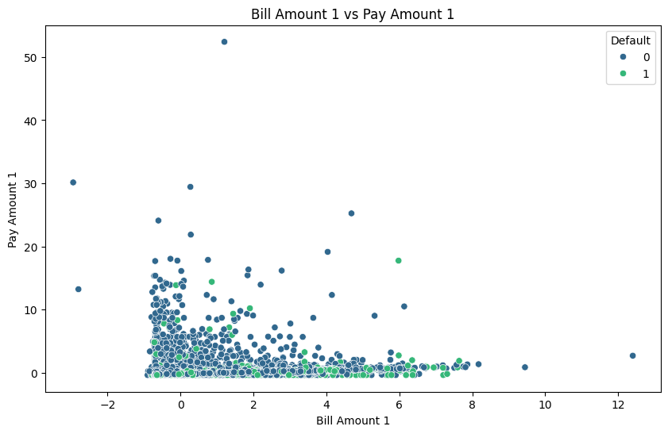
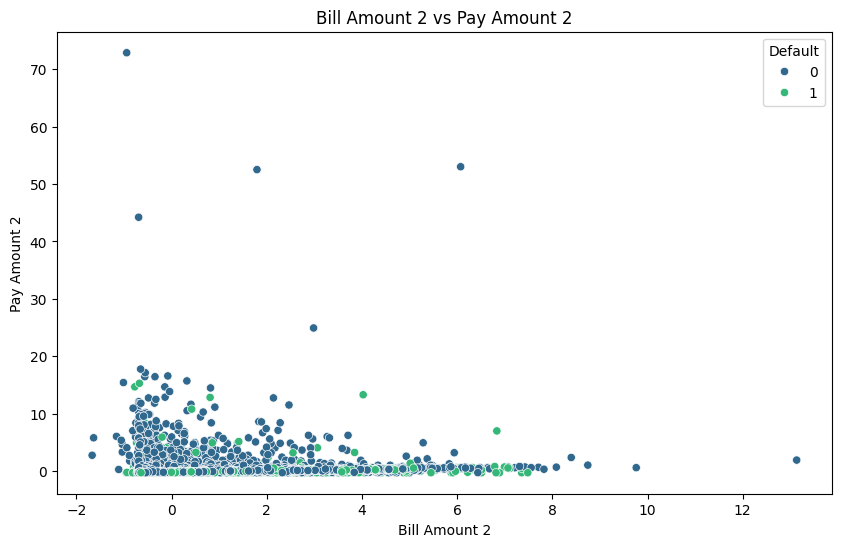

**Credit Card Default Prediction**

**Overview**

This project involves analyzing a credit card dataset to predict default payments using various machine learning models. The dataset contains information about credit card clients in Taiwan, including demographic factors, credit limits, bill statements, payment history, and default payment status for the next month.

**Dataset Description**

The dataset consists of the following columns:

LIMIT_BAL: Amount of given credit (in NT dollars)
PAY_0 to PAY_6: History of past payments (from September to April; -1 = pay duly, 1 = payment delay for one month, 2 = payment delay for two months, etc.)
BILL_AMT1 to BILL_AMT6: Amount of bill statement (from April to September)
PAY_AMT1 to PAY_AMT6: Amount paid (from April to September)
default.payment.next.month: Default payment (1 = yes, 0 = no)

**Data Analysis**

**1. Data Cleaning and Preprocessing**
Missing Values: Checked and confirmed no missing values.
Data Types: Converted categorical variables (SEX, EDUCATION, MARRIAGE) to appropriate types.

Feature Scaling: Standardized numerical features using StandardScaler.

**2. Exploratory Data Analysis (EDA)**
Histograms: Visualized the distribution of numerical features to understand their spread and central tendency.
Correlation Matrix and Heatmap: Computed and visualized the correlation between features to identify multicollinearity and significant relationships.
Scatter Plots: Plotted pairs of features against each other to observe relationships and patterns.

**Machine Learning Models**

Three machine learning models were used to predict default payments:
Logistic Regression
Decision Tree Classifier
Random Forest Classifier

**Model Evaluation**

Each model was evaluated using the following metrics:
Accuracy: Proportion of correct predictions.
Precision: Proportion of positive identifications that were actually correct.

Recall: Proportion of actual positives that were identified correctly.
F1 Score: Harmonic mean of precision and recall.

**Visualizations**

1. Histograms

2. Heatmap of Correlation Matrix

3. Scatter Plots

4. Confusion Matrices
Confusion matrices were visualized to assess the performance of the classification models.

**Results**

Logistic Regression: Provided a baseline for comparison with an accuracy of 80.5%.

Decision Tree Classifier: Showed overfitting with an accuracy of 72.3%, but precision and recall varied.
           

Random Forest Classifier: Achieved the highest accuracy of 81.5%, with balanced precision, recall, and F1 score.

**Conclusion**

This project demonstrates the application of various machine learning models to predict credit card default. The Random Forest Classifier performed the best in terms of accuracy and generalizability. The visualizations provided insights into the data distributions, correlations, and model performance.

**Future Work**

Feature Engineering: Create new features to enhance model performance.
Hyperparameter Tuning: Optimize model parameters for better accuracy.
Ensemble Methods: Combine multiple models to improve prediction performance.

**Usage**

To run the analysis and models, execute the provided Python scripts in a Jupyter notebook or any Python environment.

**Acknowledgments**

The dataset used in this project was sourced from the UCI Machine Learning Repository.
